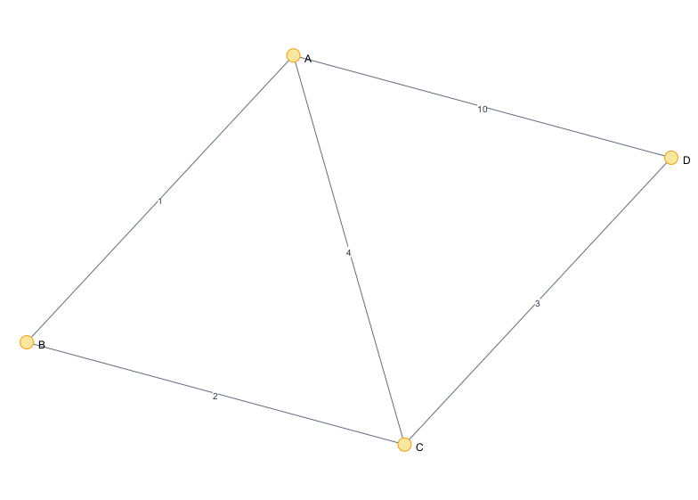
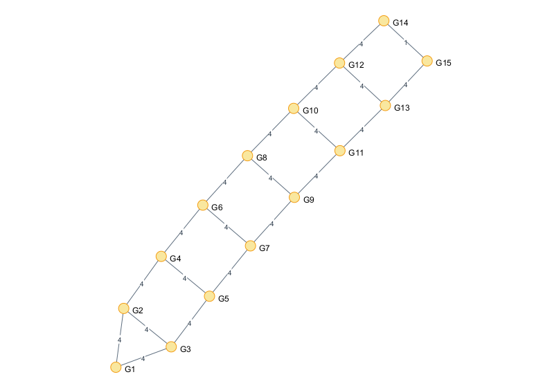
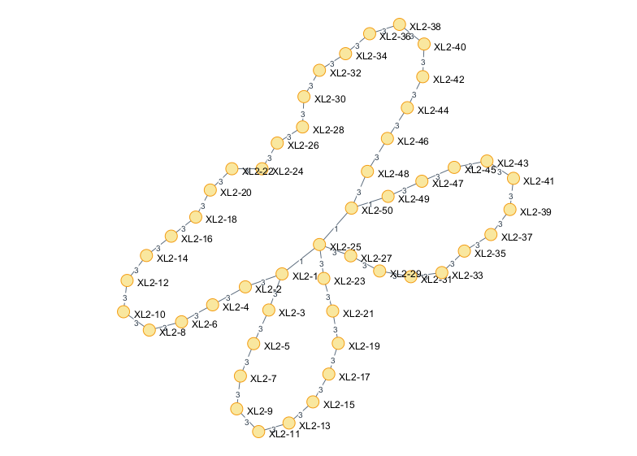

# Assignment 3: City Transportation Network Optimization (MST)

Analysis of Prim's and Kruskal's algorithms for finding the Minimum Spanning Tree (MST) in city transportation networks.

## 1. Results Summary

* **Algorithms Implemented:** Prim's, Kruskal's
* **Input Data:** 28 graphs (Small, Medium, Large, Extra Large) read from `ass_3_input.json`.
* **Output Data:** MST edges, total cost, operation counts, and execution times saved to `ass_3_output.json`.

### Performance Snapshot

| Graph ID | Category | V | E | MST Cost (Prim/Kruskal) | Time Prim (ms) | Time Kruskal (ms) | Ops Prim | Ops Kruskal |
|:---:|:---:|:---:|:---:|:---:|:---:|:---:|:---:|:---:|
| 1 | Small | 4 | 5 | 6 | 0.3876 | 10.3639 | 39 | 45 |
| 2 | Small | 5 | 7 | 16 | 0.0364 | 0.0251 | 55 | 68 |
| 15 | Medium | 15 | 21 | 53 | 0.0646 | 0.0394 | 163 | 293 |
| 20 | Large | 30 | 31 | 56 | 0.1064 | 0.0977 | 273 | 479 |
| 27 | X-Large | 50 | 52 | 141 | 0.1736 | 0.1059 | 462 | 842 |

**Key Observations:**
1.  **Correctness:** The total MST cost calculated by both Prim's and Kruskal's algorithms was identical for all 28 graphs, verifying the correctness of both implementations.
2.  **Performance (Time):** Kruskal's algorithm generally completed faster than Prim's algorithm across most test cases, especially on larger graphs (except for Graph ID 1, which might be an anomaly due to small size or measurement noise).
3.  **Performance (Operations):** The estimated operation count was significantly higher for Kruskal's algorithm in this implementation, contrary to typical expectations. This might be due to the specific way operations were counted (e.g., DSU operations might be counted differently or be less efficient than priority queue operations in this setup).

---

## 2. Algorithm Comparison

### Theoretical Efficiency

* **Kruskal's Algorithm:** The time complexity is dominated by sorting the edges, which takes $O(E \log E)$ time. Using a Disjoint Set Union (DSU) with path compression and union-by-rank adds a nearly linear factor, $O(E \cdot \alpha(V))$, which is very fast in practice. Thus, the overall complexity is effectively $O(E \log E)$ or $O(E \log V)$.
* **Prim's Algorithm:** The complexity depends heavily on the priority queue implementation used.
    * With a binary heap (like Java's `PriorityQueue`), storing vertices, it's $O(E \log V)$.
    * My implementation stores *edges* in the `PriorityQueue`. While conceptually simpler for adding edges, this can lead to more elements in the queue, potentially resulting in a worst-case complexity closer to $O(E \log E)$, similar to Kruskal's.

### Practical Performance

The input graphs used in this assignment are **sparse graphs** (where $E$ is close to $V$). For sparse graphs, the theoretical complexities of both algorithms often converge towards $O(V \log V)$.

**Why Kruskal's was faster in practice (Time):**
* **Efficient Sorting:** Java's `Collections.sort()` (Timsort) is highly optimized for sorting the initial list of edges.
* **Fewer Complex Operations:** Although the counted operations were higher, the *type* of operations in Kruskal (sorting + DSU) might have lower constant factors or better cache performance compared to the heap operations in Prim's.

**Note on Operation Counts:** The higher operation count for Kruskal's is unusual and might stem from the implementation details of the DSU and how its operations (`find`, `union`, internal map operations) were summed, potentially overcounting compared to the operations counted in Prim's (priority queue additions/removals, adjacency list access).

---

## 3. Conclusions

* **Kruskal's Algorithm** is generally preferred for **sparse graphs**, like the road networks in this assignment. It performed better in terms of execution time in most cases. It naturally handles disconnected graphs by producing a Minimum Spanning Forest.
* **Prim's Algorithm** can be more efficient for **dense graphs** (where $E$ approaches $V^2$), especially if implemented using an adjacency matrix and Fibonacci heap ($O(E + V \log V)$).

For the specific task of optimizing a city transportation network (typically sparse), **Kruskal's algorithm demonstrated superior practical time performance** in this implementation, despite the potentially misleading operation count metric.

---

## 4. Bonus Section: Graph Visualization

* A custom graph data structure (`Graph.java`, `Edge.java`) was implemented as required for the bonus.
* A `GraphVisualizer.java` class was created using the `org.graphstream` library to generate `.png` images for all 28 input graphs.
* This demonstrates that the custom graph structure loads correctly and integrates with visualization tools.

### Sample Visualizations

**Graph 1 (Small)**

**Graph 15 (Medium)**

**Graph 27 (Extra Large)**

---

## 5. References

* Assignment 3 PDF Description .
* GraphStream Library Documentation.